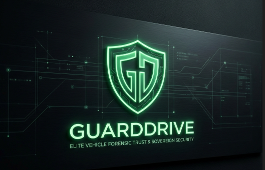
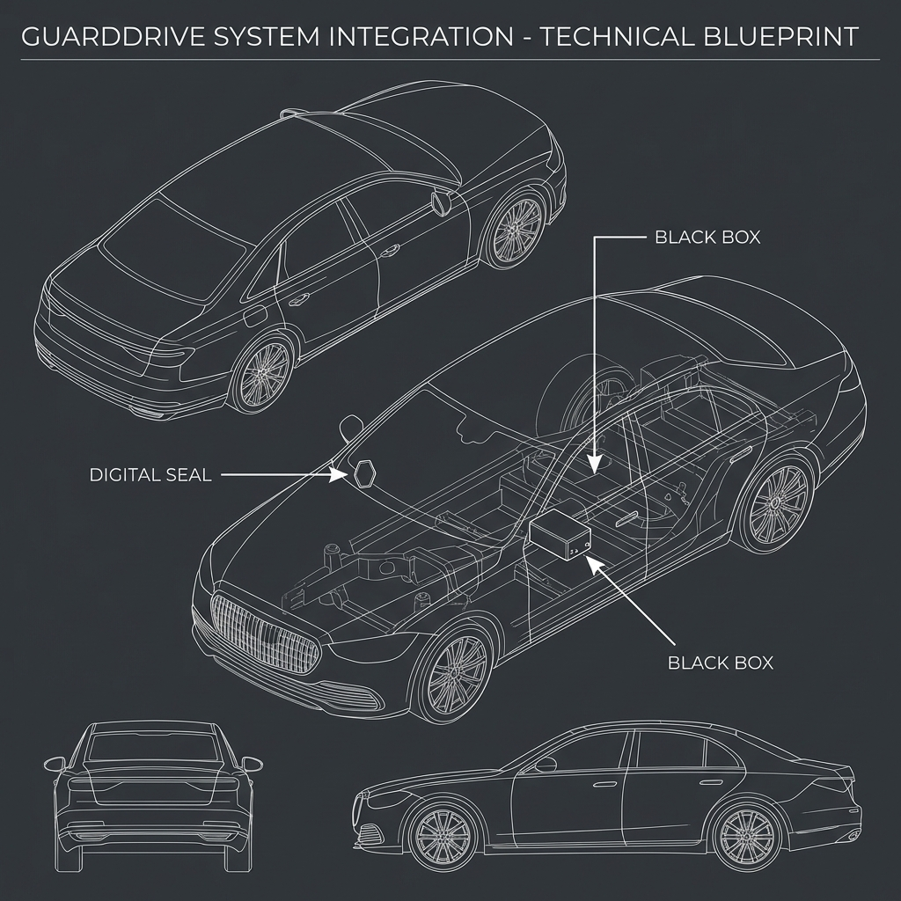
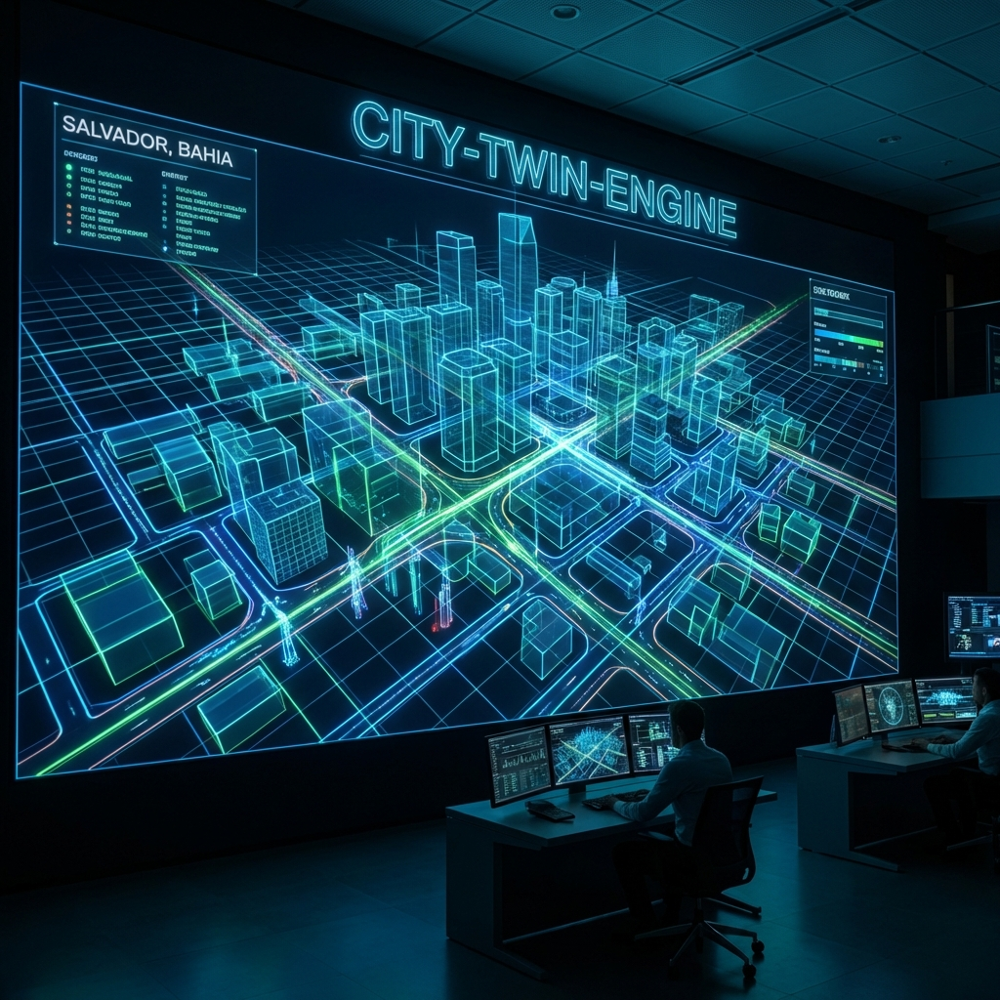
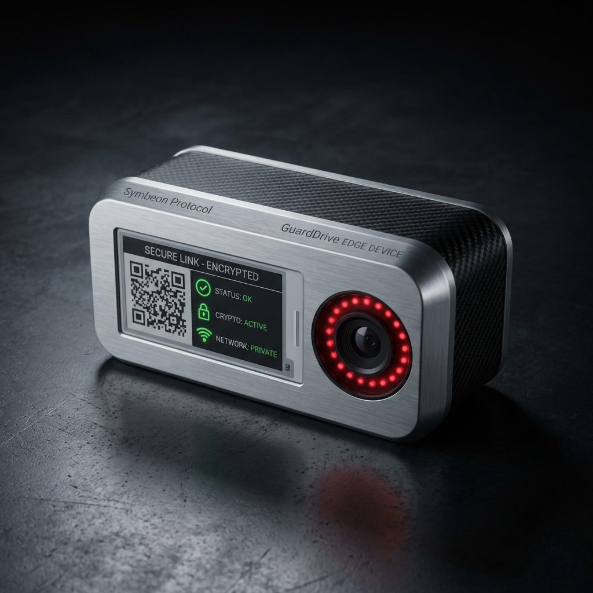
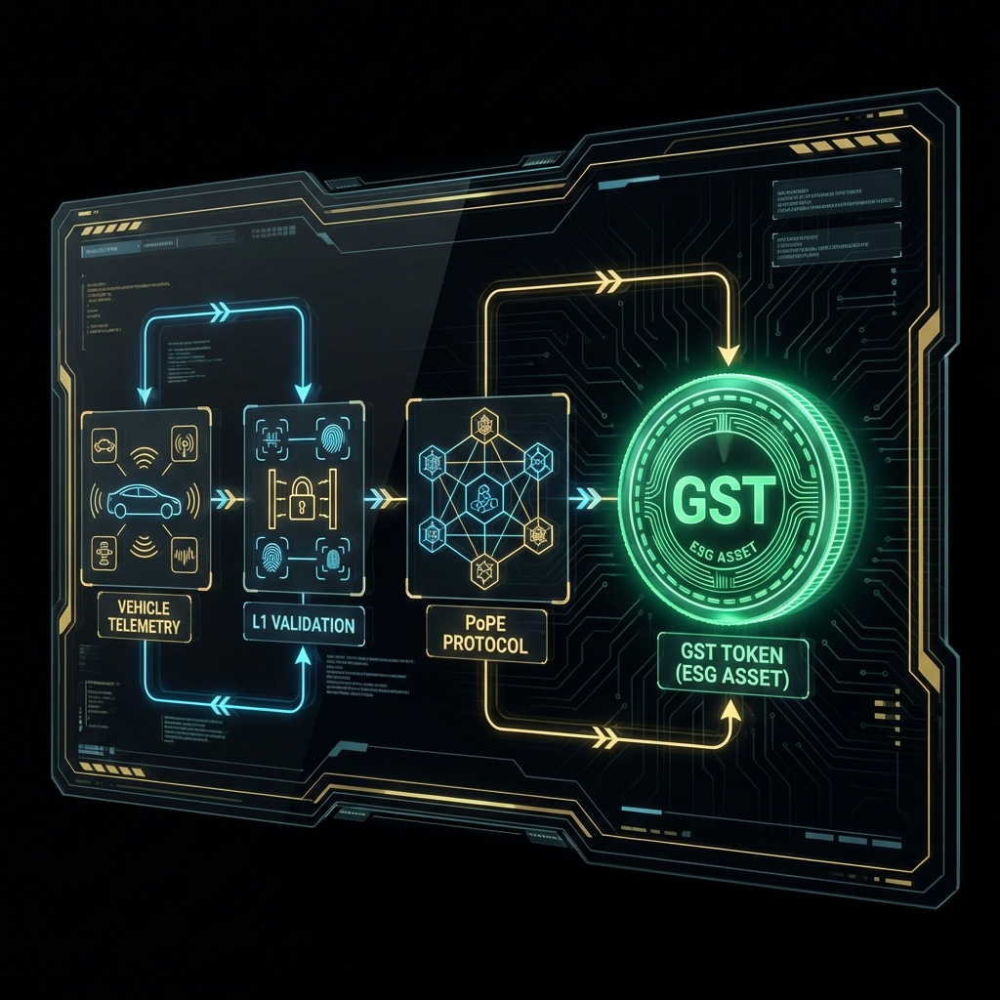
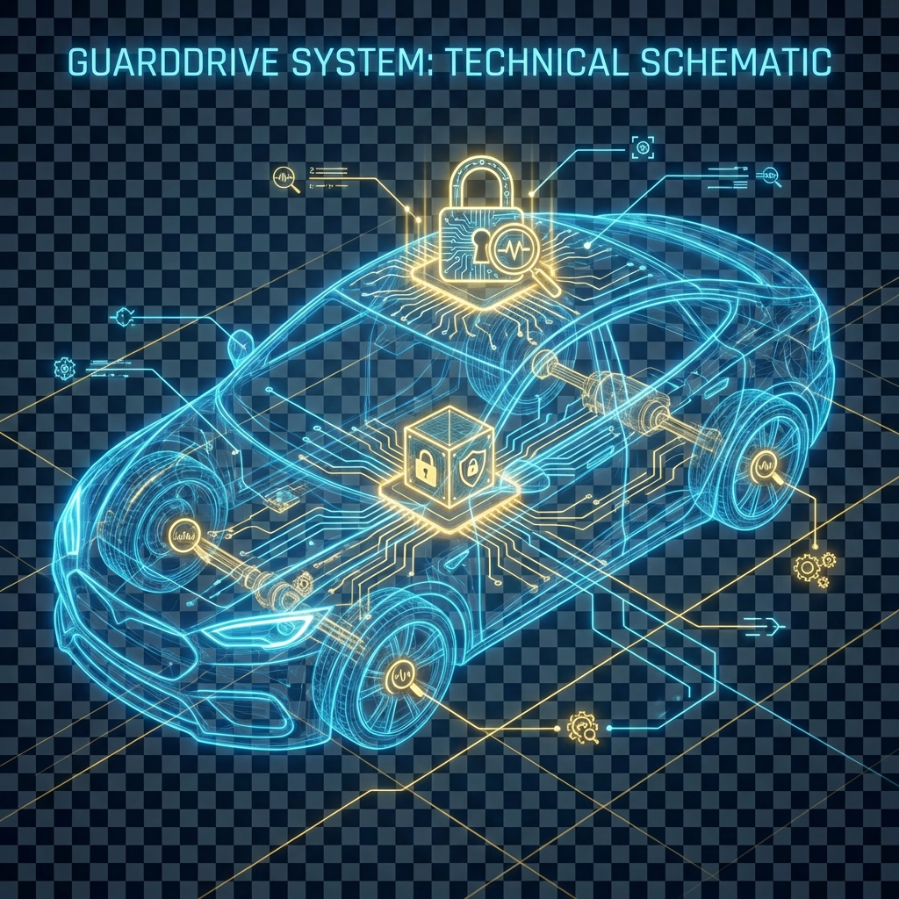

<!-- 
  SEO Keywords: Vehicle Forensics, ESG Tokenization, Sovereign Infrastructure, Blockchain Telemetry, Automotive Cybersecurity, Symbeon Protocol, Trinity Rigor Standard, Digital Twin Mobility
  Description: GuardDrive - The global standard for high-confidence mobility forensics and ESG tokenization.
-->

  

# 🦅 GUARDDRIVE
## The Global Standard for Sovereign Mobility Infrastructure

**Establishing Absolute Truth and Economic Value through High-Confidence Telematic Forensics.**

---

## 🏛️ The Foundation: Decentralized Forensic Truth

**GuardDrive** is the world’s first high-confidence vertical for autonomous and connected vehicle forensics. As transportation shifts into data-driven ecosystems, we provide the **undeniable base of truth** required for institutional trust, legal auditability, and insurance precision.

By integrating the **Symbeon Protocol** and the **Trinity Rigor Standard**, we transmute raw telematic streams into **Sovereign Assets**—evidence that is immutable, auditably proven, and ethically weighted.

---

## 🚀 The Hub: Strategic Digital Twin Command Center

The **GuardDrive Pilot** serves as our primary geospatial portal. It is a high-fidelity **Digital Twin** designed to virtualize urban mobility environments, demonstrating the real-world application of our forensic validation engines.

> **[ENTER THE PILOT COMMAND](https://guarddrive-pilot.vercel.app)**  
> *Materializing the future of Sovereign Infrastructure in real-time.*

---

## 💎 Institutional Pillars & ESG Innovation

<table align="center">
  <tr>
    <td align="center" width="33%">
       
      <b>Industrial Hardware</b> V3 Serious Root of Trust
    </td>
    <td align="center" width="33%">
       
      <b>ESG Tokenization</b> V3 Green Infrastructure
    </td>
    <td align="center" width="33%">
       
      <b>Forensic Analytics</b> High-Confidence Validation
    </td>
  </tr>
</table>

### 🔐 Strategic Sovereignty & IP Security
Our infrastructure is engineered for global scalability. All core algorithmic logic and strategic assets are protected under **Sovereign IP Lockdown**, ensuring that industrial partners and government entities can audit our frameworks through sanitized технические vitrines and secure private environments.

---

 
**Division of Symbeon Labs**

*Engineering Trust. Monetizing Truth. Securing the Future.*

